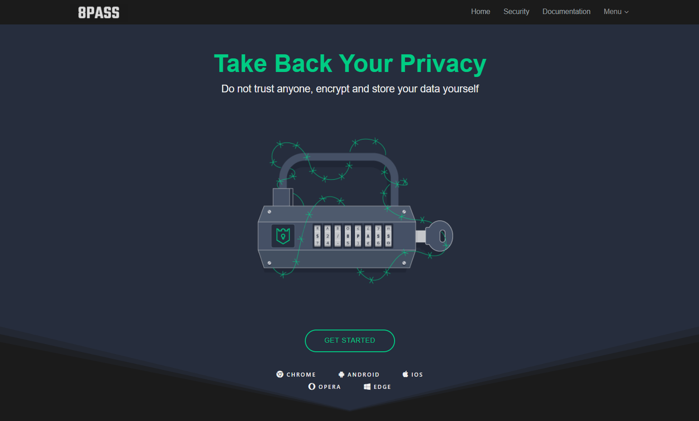
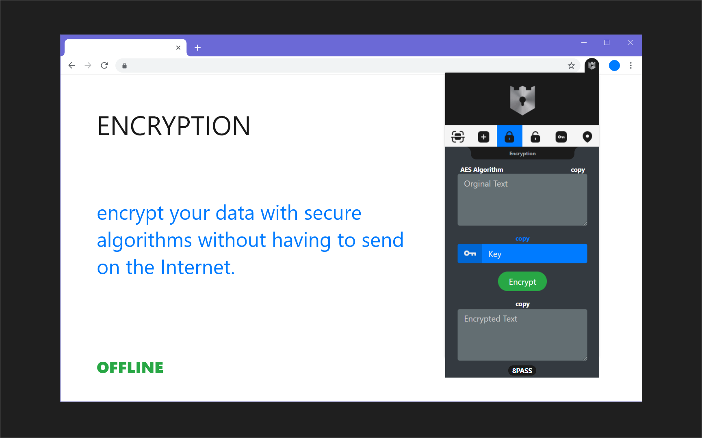
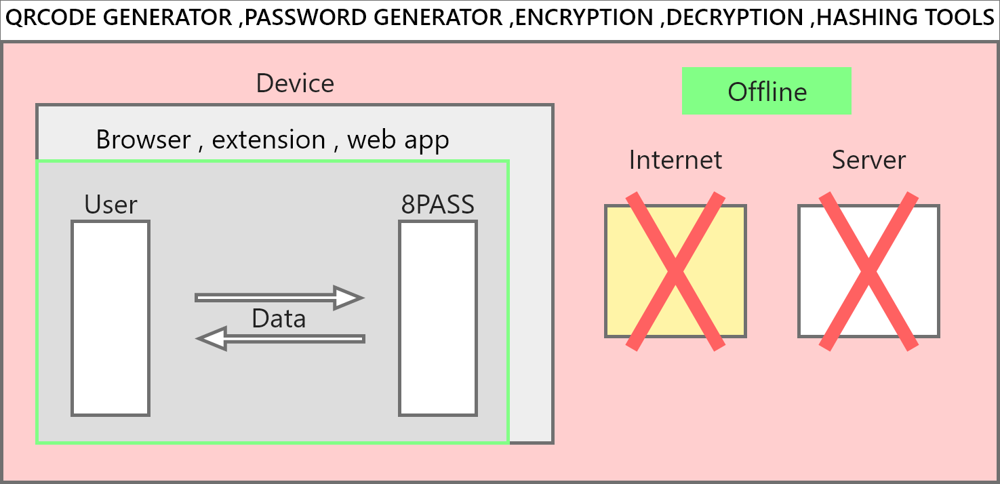

<h1 align="center">
  8PASS | RA8
   
</h1>
<h1 style="flex">
   
  
  
   
</h1>

Live Preview <a href="https://8pass.ra8.ir" title="8pass.ra8.ir">( 8pass.ra8.ir )</a>

8PASS Browser Extension Is Available On <a href="https://chromewebstore.google.com/detail/8pass-security-tools/akgolcghbkfenobondknebgbebmckhio" title="8pass">( CHROME WEB STORE )</a>

The Security Tools You Need To Securely Encrypt And Protect Your Sensitive Data

## Features
- QRCODE GENERATOR
- PASSWORD GENERATOR
- ENCRYPTION
- DECRYPTION
- HASHING TOOLS
- IP ADDRESS LOOKUP

 

## How it works

## RA8

Developed And Designed By <a href="https://ra8.ir" title="RA8.ir">RA8.ir</a>
